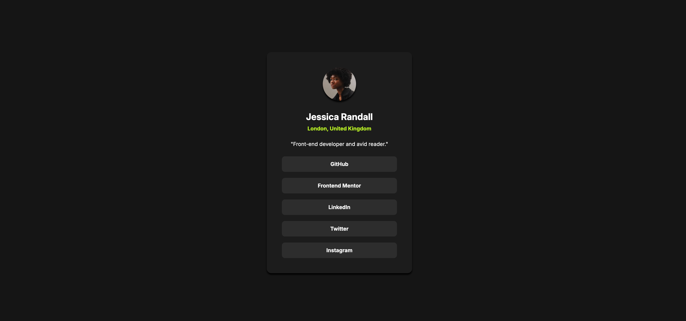

# Frontend Mentor - Social links profile solution

This is a solution to the [Social links profile challenge on Frontend Mentor](https://www.frontendmentor.io/challenges/social-links-profile-UG32l9m6dQ). Frontend Mentor challenges help you improve your coding skills by building realistic projects.

## Table of contents

- [Overview](#overview)
  - [The challenge](#the-challenge)
  - [Screenshot](#screenshot)
  - [Links](#links)
- [My process](#my-process)
  - [Built with](#built-with)
  - [What I learned](#what-i-learned)
  - [Useful resources](#useful-resources)
- [Author](#author)

## Overview

### The challenge

Users should be able to:

- See hover and focus states for all interactive elements on the page

### Screenshot



### Links

- Solution URL: [https://github.com/wideirp/social-links-profile](https://github.com/wideirp/social-links-profile)
- Live Site URL: [https://wideirp.github.io/social-links-profile/](https://wideirp.github.io/social-links-profile/)

## My process

### Built with

- Semantic HTML5 markup
- CSS custom properties
- Flexbox
- Mobile-first workflow

### What I learned

Using tabindex for keyboard navigation and accessibility

```html
<nav class="links">
  <li href="#" tabindex="0">GitHub</li>
  <li href="#" tabindex="0">Frontend Mentor</li>
  <li href="#" tabindex="0">LinkedIn</li>
  <li href="#" tabindex="0">Twitter</li>
  <li href="#" tabindex="0">Instagram</li>
</nav>
```

### Useful resources

- [MDN tabindex reference](https://developer.mozilla.org/en-US/docs/Web/HTML/Global_attributes/tabindex)

## Author

- Website - [wideirp.github.io](https://wideirp.github.io)
- Frontend Mentor - [@wideirp](https://www.frontendmentor.io/profile/wideirp)
- Twitter - [@w1d31rp](https://www.twitter.com/w1d31rp)
